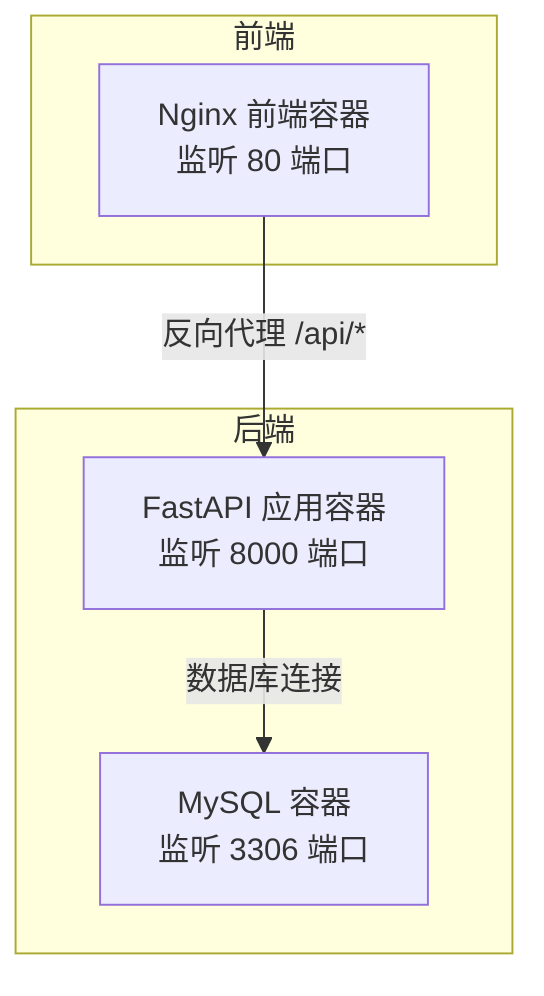
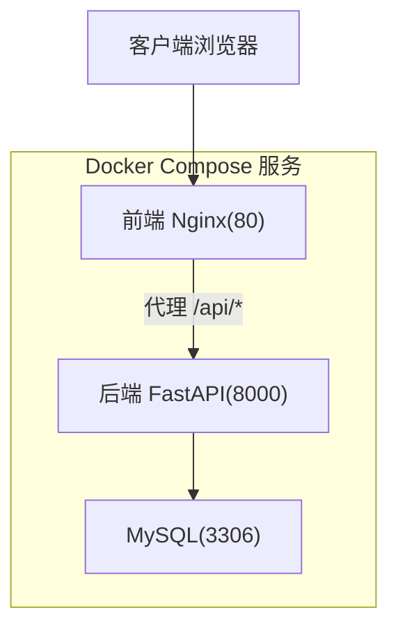
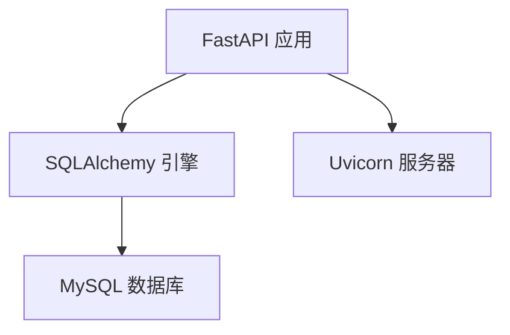

# 监控告警

<cite>
**本文引用的文件**
- [main.py](file://blog_backend/main.py)
- [dockerfile](file://blog_backend/dockerfile)
- [docker-compose.yml](file://docker-compose.yml)
- [config.py](file://blog_backend/config.py)
- [database.py](file://blog_backend/database.py)
- [pyproject.toml](file://blog_backend/pyproject.toml)
- [default.conf](file://blog_backend/default.conf)
- [nginx.conf](file://blog_frontend/nginx.conf)
- [job.py](file://blog_backend/routers/job.py)
- [.gitignore](file://.gitignore)
</cite>

## 目录
1. [简介](#简介)
2. [项目结构](#项目结构)
3. [核心组件](#核心组件)
4. [架构总览](#架构总览)
5. [详细组件分析](#详细组件分析)
6. [依赖分析](#依赖分析)
7. [性能考虑](#性能考虑)
8. [故障排查指南](#故障排查指南)
9. [结论](#结论)
10. [附录](#附录)

## 简介
本文件面向系统运维与开发团队，提供该博客项目的系统监控与告警实践文档。内容覆盖应用健康检查（Liveness/Readiness 探针）、健康检查端点与响应时间监控、日志采集与管理、性能监控指标（CPU/内存/数据库连接/API 响应时间）、应用监控（FastAPI 指标暴露、Prometheus 集成、Grafana 仪表板）、告警规则（阈值、级别、通知渠道）、分布式追踪（请求链路与性能瓶颈分析），以及监控工具使用指南（Kibana 日志分析、Zabbix 系统监控、自定义监控脚本）与故障预警及应急响应流程。

## 项目结构
该项目采用前后端分离架构，后端基于 FastAPI，前端基于 Nginx 静态资源与反向代理，数据库使用 MySQL。容器编排通过 Docker Compose 实现，便于本地开发与部署。

图表来源
- [docker-compose.yml:13-35](file://docker-compose.yml#L13-L35)
- [nginx.conf:12-19](file://blog_frontend/nginx.conf#L12-L19)
- [dockerfile:15-16](file://blog_backend/dockerfile#L15-L16)

章节来源
- [docker-compose.yml:1-41](file://docker-compose.yml#L1-41)
- [dockerfile:1-17](file://blog_backend/dockerfile#L1-L17)
- [nginx.conf:1-25](file://blog_frontend/nginx.conf#L1-L25)

## 核心组件
- 后端应用入口与路由注册：后端通过 FastAPI 创建应用实例，并注册用户、文章、招聘、记账、Boss 等路由模块。
- 数据库连接：通过 SQLAlchemy 初始化引擎与会话，统一依赖注入。
- 配置管理：读取环境变量构建数据库连接字符串，提供默认密钥与爬虫基础地址等配置。
- 健康检查与端口暴露：后端容器以 8000 端口对外提供服务；前端容器以 80 端口对外提供静态资源与反向代理。
- 日志与错误处理：部分路由模块引入日志记录，便于问题定位与审计。

章节来源
- [main.py:1-13](file://blog_backend/main.py#L1-L13)
- [database.py:1-18](file://blog_backend/database.py#L1-L18)
- [config.py:1-32](file://blog_backend/config.py#L1-L32)
- [dockerfile:15-16](file://blog_backend/dockerfile#L15-L16)

## 架构总览
下图展示容器间交互与流量走向，包括前端 Nginx 反向代理后端 API、后端访问数据库、以及容器编排与端口映射关系。

图表来源
- [docker-compose.yml:13-35](file://docker-compose.yml#L13-L35)
- [nginx.conf:12-19](file://blog_frontend/nginx.conf#L12-L19)
- [dockerfile:15-16](file://blog_backend/dockerfile#L15-L16)

## 详细组件分析

### 健康检查与探针配置
- Liveness 探针建议：探测后端应用进程是否存活，可使用 TCP Socket 或 HTTP GET /health（需在后端实现）。若未实现健康端点，可使用 TCP 探针探测 8000 端口。
- Readiness 探针建议：探测后端是否已就绪可接收请求。可在后端实现 /ready 并在启动阶段完成数据库连接校验后再标记就绪。
- 健康检查端点建议：
  - /health：返回应用状态（如 OK），用于存活检测。
  - /ready：返回就绪状态（如 OK），用于就绪检测。
- 响应时间监控：通过探针的超时与周期参数配合外部监控系统（如 Prometheus + Grafana）进行 SLO/SLA 跟踪。

说明：当前仓库未包含健康检查端点实现，建议在后端新增对应路由以完善可观测性。

### 日志收集与管理
- 容器日志聚合：后端容器通过 Uvicorn 启动，标准输出即容器日志；前端容器使用 Nginx，标准输出亦可被容器平台捕获。
- 日志轮转：建议在生产环境使用 systemd/journald 或 logrotate 对容器日志进行轮转与归档。
- 日志分析工具配置：
  - Kibana：结合 Elasticsearch/Fluent Bit/Fluentd 收集容器日志，建立索引模板与可视化面板。
  - 日志字段建议：时间戳、容器名、服务名、日志级别、消息正文、请求 ID、用户 ID 等。
- 本地开发日志：.gitignore 中包含日志文件模式，避免误提交。

章节来源
- [.gitignore:57-65](file://.gitignore#L57-L65)
- [dockerfile:6-7](file://blog_backend/dockerfile#L6-L7)

### 性能监控指标
- CPU 使用率：通过操作系统或容器平台（如 cAdvisor/Prometheus Node Exporter）采集。
- 内存占用：采集 RSS/堆内存等指标，结合 GC 统计（如 Python 应用）。
- 数据库连接数：监控 MySQL 连接数、排队等待、慢查询等指标。
- API 响应时间：对 /api/* 路由按路径、方法、状态码分组统计 P50/P90/P95。
- 指标来源建议：
  - FastAPI 应用：可通过中间件或第三方库导出指标。
  - Prometheus：抓取 Node Exporter、应用指标、数据库指标。
  - Grafana：建立仪表板，配置告警与通知。

说明：当前仓库未包含指标导出与监控集成代码，建议后续补充。

### 应用监控配置（FastAPI、Prometheus、Grafana）
- FastAPI 指标暴露：在后端增加中间件或使用指标库，导出 HTTP 请求计数、持续时间、错误计数等。
- Prometheus 集成：配置 Prometheus 抓取后端指标端点，设置抓取间隔与超时。
- Grafana 仪表板：创建数据源（Prometheus），导入或编写面板（CPU、内存、数据库连接、API 响应时间、健康状态）。

说明：当前仓库未包含指标导出与监控集成代码，建议后续补充。

### 告警规则配置
- 阈值设置：
  - 健康检查失败率 > 10%（5 分钟窗口）
  - API 响应时间 P95 > 2 秒
  - 数据库连接数 > 80% 最大连接数
  - 内存使用率 > 85%
- 告警级别：警告（Warn）、严重（Critical）
- 通知渠道：邮件、企业微信、Slack、PagerDuty

说明：当前仓库未包含告警规则与通知配置，建议后续补充。

### 分布式追踪配置
- 请求链路追踪：在后端引入 OpenTelemetry SDK，对 /api/* 路由生成 Trace Span，记录数据库调用、外部接口调用等。
- 性能瓶颈分析：通过 Trace 视图定位慢查询、慢依赖、热点接口，结合指标面板进行根因分析。

说明：当前仓库未包含追踪相关代码，建议后续补充。

### 监控工具使用指南
- Kibana 日志分析：建立索引模式，配置字段类型，创建可视化图表与仪表板。
- Zabbix 系统监控：安装 Zabbix Agent，配置主机发现与监控项（CPU、内存、磁盘、网络、进程），创建触发器与动作。
- 自定义监控脚本：编写 Shell/Python 脚本采集业务指标（如爬虫任务状态、数据库延迟），推送至 Prometheus Pushgateway 或写入 Zabbix trapper。

说明：当前仓库未包含上述工具的具体配置文件，建议后续补充。

## 依赖分析
后端依赖包括 FastAPI、SQLAlchemy、Uvicorn、PyMySQL 等，这些组件直接影响应用可用性与性能表现。数据库连接通过配置文件读取环境变量构建，确保在不同环境的一致性。

图表来源
- [pyproject.toml:7-21](file://blog_backend/pyproject.toml#L7-L21)
- [database.py:7](file://blog_backend/database.py#L7)
- [config.py:3-11](file://blog_backend/config.py#L3-L11)

章节来源
- [pyproject.toml:1-22](file://blog_backend/pyproject.toml#L1-L22)
- [database.py:1-18](file://blog_backend/database.py#L1-L18)
- [config.py:1-32](file://blog_backend/config.py#L1-L32)

## 性能考虑
- 数据库连接池：合理设置连接数上限与空闲回收策略，避免连接泄漏。
- API 响应时间优化：缓存热点数据、异步处理耗时任务、减少 N+1 查询。
- 前端静态资源：Nginx 提供 Gzip/HTTP/2 加速，CDN 缓存提升加载速度。
- 容器资源限制：在 Docker Compose 中设置 CPU/内存限制，防止资源争抢。

## 故障排查指南
- 健康检查失败
  - 检查后端容器是否正常启动（查看日志）。
  - 若未实现 /health，则使用 TCP 探针探测 8000 端口。
- API 5xx 错误
  - 查看后端异常日志与数据库连接状态。
  - 确认数据库服务可达与凭据正确。
- 前端无法访问
  - 检查 Nginx 反向代理配置与后端服务连通性。
- 日志缺失
  - 确认容器日志输出与日志轮转配置。
  - 检查 .gitignore 是否排除了日志文件。

章节来源
- [job.py:11-13](file://blog_backend/routers/job.py#L11-L13)
- [docker-compose.yml:13-35](file://docker-compose.yml#L13-L35)
- [nginx.conf:12-19](file://blog_frontend/nginx.conf#L12-L19)

## 结论
本项目具备良好的容器化与反向代理基础，但尚未实现完整的健康检查端点、指标导出、日志聚合与告警规则。建议按本文档逐步补齐：新增健康/就绪端点、接入指标导出与 Prometheus、配置 Kibana/Zabbix、制定告警规则与通知渠道，并引入分布式追踪以支撑性能优化与故障定位。

## 附录
- 健康检查端点建议实现位置：后端应用根路径，返回应用状态与依赖健康情况。
- 日志分析建议字段：timestamp、service、level、message、trace_id、span_id、user_id、request_id。
- 指标建议：HTTP 请求总量/错误率/响应时间、数据库连接数/慢查询、系统 CPU/内存/IO。
- 告警建议：基于 SLO/SLI 设定阈值，区分级别并通过多渠道通知。