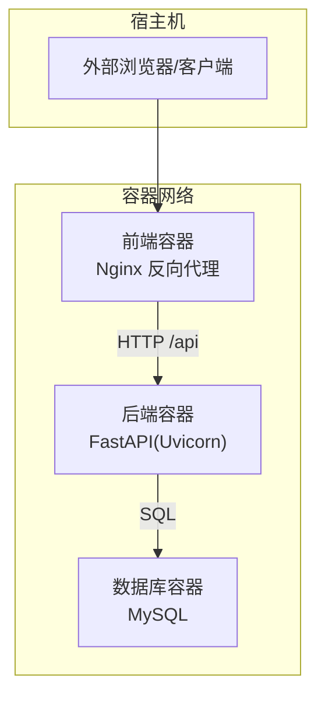
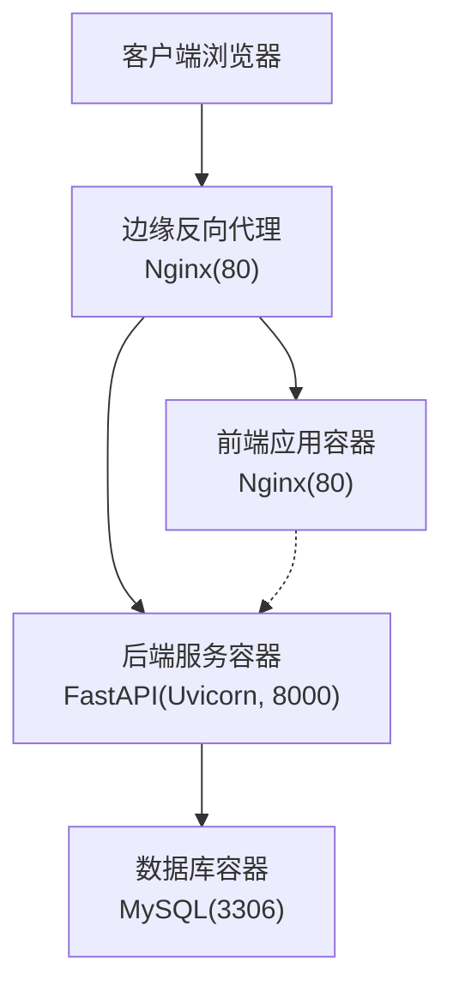
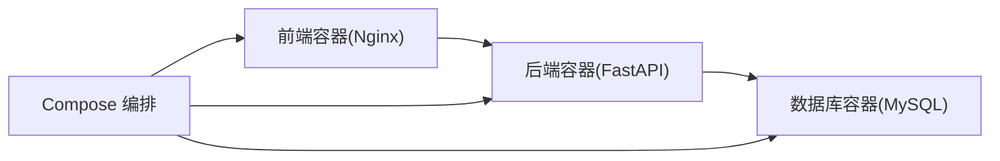
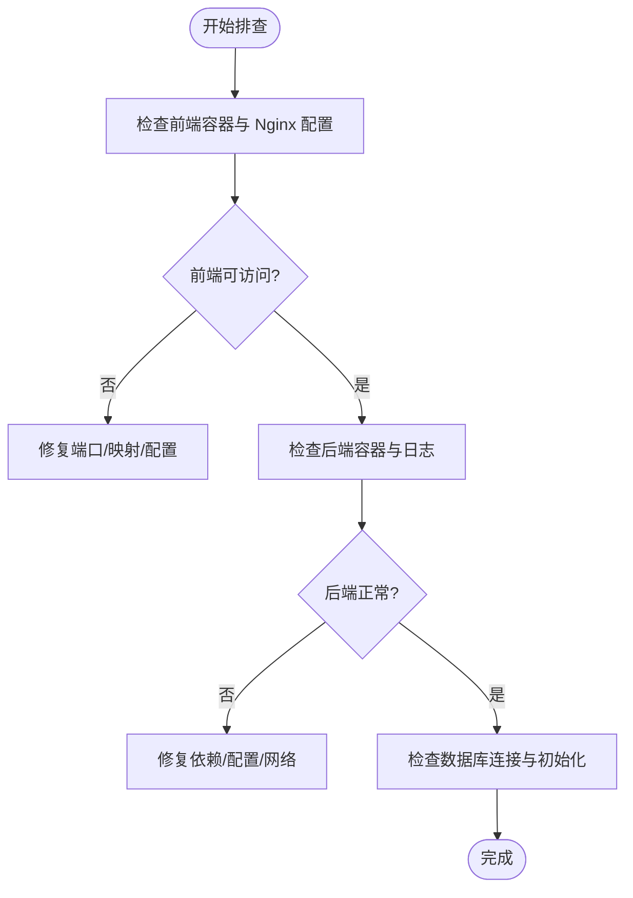

# 部署运维

<cite>
**本文引用的文件**
- [docker-compose.yml](file://docker-compose.yml)
- [blog_backend/dockerfile](file://blog_backend/dockerfile)
- [blog_frontend/dockerfile](file://blog_frontend/dockerfile)
- [blog_frontend/nginx.conf](file://blog_frontend/nginx.conf)
- [blog_backend/main.py](file://blog_backend/main.py)
- [blog_backend/config.py](file://blog_backend/config.py)
- [blog_backend/database.py](file://blog_backend/database.py)
- [blog_backend/init_db.py](file://blog_backend/init_db.py)
- [blog_backend/default.conf](file://blog_backend/default.conf)
- [blog_backend/pyproject.toml](file://blog_backend/pyproject.toml)
- [blog_frontend/package.json](file://blog_frontend/package.json)
- [blog_frontend/vite.config.js](file://blog_frontend/vite.config.js)
- [blog_backend/utils/crawl.py](file://blog_backend/utils/crawl.py)
- [blog_backend/routers/job.py](file://blog_backend/routers/job.py)
</cite>

## 目录
1. [简介](#简介)
2. [项目结构](#项目结构)
3. [核心组件](#核心组件)
4. [架构总览](#架构总览)
5. [详细组件分析](#详细组件分析)
6. [依赖关系分析](#依赖关系分析)
7. [性能与容量规划](#性能与容量规划)
8. [安全与密钥管理](#安全与密钥管理)
9. [CI/CD 与自动化部署](#cicd-与自动化部署)
10. [监控与日志](#监控与日志)
11. [故障排查指南](#故障排查指南)
12. [扩展性与高可用](#扩展性与高可用)
13. [灾难恢复计划](#灾难恢复计划)
14. [结论](#结论)

## 简介
本文件面向生产环境的部署与运维，基于仓库现有 Docker 化与 Compose 编排能力，系统化梳理镜像构建、服务编排、反向代理、数据库部署与备份、配置与密钥管理、CI/CD 流水线、监控与日志、故障排查、扩展与高可用以及灾备策略。文档以“可落地”为原则，结合代码与配置文件进行说明，并提供可视化图示帮助快速定位问题与优化路径。

## 项目结构
项目采用前后端分离的多容器架构，通过 Docker Compose 将 MySQL、后端服务（FastAPI+Uvicorn）与前端 Nginx 反代统一编排，便于开发与生产环境一致化部署。

图表来源
- [docker-compose.yml:1-41](file://docker-compose.yml#L1-L41)
- [blog_frontend/nginx.conf:1-26](file://blog_frontend/nginx.conf#L1-L26)
- [blog_backend/main.py:1-13](file://blog_backend/main.py#L1-L13)

章节来源
- [docker-compose.yml:1-41](file://docker-compose.yml#L1-L41)
- [blog_frontend/nginx.conf:1-26](file://blog_frontend/nginx.conf#L1-L26)
- [blog_backend/main.py:1-13](file://blog_backend/main.py#L1-L13)

## 核心组件
- 前端容器（Nginx）
  - 使用多阶段构建：Node 构建产物，Nginx 提供静态资源与反向代理。
  - 暴露 80 端口，映射至宿主 80。
  - 通过 /api 路由代理到后端服务。
- 后端容器（FastAPI/Uvicorn）
  - 基于 Python 3.11 slim 镜像，安装依赖后以 Uvicorn 运行。
  - 暴露 8000 端口，映射至宿主 8001。
  - 通过环境变量连接数据库。
- 数据库容器（MySQL）
  - 使用持久卷挂载，保留数据。
  - 暴露 3306 端口，映射至宿主 3306。

章节来源
- [blog_frontend/dockerfile:1-25](file://blog_frontend/dockerfile#L1-L25)
- [blog_backend/dockerfile:1-17](file://blog_backend/dockerfile#L1-L17)
- [docker-compose.yml:1-41](file://docker-compose.yml#L1-L41)

## 架构总览
下图展示生产环境典型拓扑：Nginx 作为边缘反代，负责静态资源与 API 转发；后端服务处理业务逻辑与数据库交互；数据库提供持久化存储。

图表来源
- [blog_frontend/nginx.conf:1-26](file://blog_frontend/nginx.conf#L1-L26)
- [blog_backend/main.py:1-13](file://blog_backend/main.py#L1-L13)
- [docker-compose.yml:1-41](file://docker-compose.yml#L1-L41)

## 详细组件分析

### 前端容器（Nginx 反向代理）
- 多阶段构建：Node 构建产物，Nginx 提供静态站点与反向代理。
- 关键点
  - 静态资源根目录与首页索引。
  - 对 /api 的代理目标为后端服务地址。
  - 错误页与通用头部透传。
- 运维要点
  - 生产建议启用 HTTPS 并配置证书。
  - 可增加限流、缓存与健康检查。
  - 如需支持热更新或开发调试，可参考默认反代配置。

章节来源
- [blog_frontend/dockerfile:1-25](file://blog_frontend/dockerfile#L1-L25)
- [blog_frontend/nginx.conf:1-26](file://blog_frontend/nginx.conf#L1-L26)
- [blog_backend/default.conf:1-27](file://blog_backend/default.conf#L1-L27)

### 后端容器（FastAPI/Uvicorn）
- 运行时
  - 基于 Python 3.11 slim，安装依赖后以 Uvicorn 启动。
  - 暴露 8000 端口，容器间通过服务名通信。
- 路由与模块
  - 主程序注册用户、文章、招聘、记账、Boss 等路由。
- 数据库连接
  - 通过环境变量拼接数据库 URL，支持 DATABASE_URL 或 DB_* 系列变量。
- 运维要点
  - 生产环境建议使用独立的数据库账号与强密码。
  - 为后端添加健康检查端点与日志级别控制。

章节来源
- [blog_backend/dockerfile:1-17](file://blog_backend/dockerfile#L1-L17)
- [blog_backend/main.py:1-13](file://blog_backend/main.py#L1-L13)
- [blog_backend/config.py:1-32](file://blog_backend/config.py#L1-L32)
- [blog_backend/database.py:1-18](file://blog_backend/database.py#L1-L18)

### 数据库容器（MySQL）
- 配置
  - 使用持久卷挂载，避免容器重建导致数据丢失。
  - 暴露 3306 端口，映射至宿主。
- 初始化
  - 可通过初始化脚本创建表结构。
- 运维要点
  - 定期备份与校验。
  - 生产环境启用只读副本与主从复制。

章节来源
- [docker-compose.yml:1-41](file://docker-compose.yml#L1-L41)
- [blog_backend/init_db.py:1-10](file://blog_backend/init_db.py#L1-L10)

### 开发调试反向代理（默认配置）
- 用于本地开发场景，将 / 代理到 Vite 开发服务器，将 /api 代理到后端。
- 特别注意：该配置使用 host.docker.internal，适用于 Docker Desktop 环境。

章节来源
- [blog_backend/default.conf:1-27](file://blog_backend/default.conf#L1-L27)

## 依赖关系分析
- 组件耦合
  - 前端依赖后端 /api 接口；后端依赖数据库。
  - Compose 通过 depends_on 控制启动顺序。
- 外部依赖
  - 后端依赖 MySQL；前端依赖后端接口。
- 潜在风险
  - 环境变量缺失可能导致连接失败。
  - 数据卷未正确挂载会导致数据丢失。

图表来源
- [docker-compose.yml:1-41](file://docker-compose.yml#L1-L41)

章节来源
- [docker-compose.yml:1-41](file://docker-compose.yml#L1-L41)

## 性能与容量规划
- 前端
  - 使用 Nginx 提供静态资源与 Gzip/缓存优化。
  - 可引入 CDN 与浏览器缓存策略。
- 后端
  - 根据并发与响应时间评估容器 CPU/内存配额。
  - 引入连接池与异步任务处理（如爬虫任务）。
- 数据库
  - 为高并发场景准备只读副本与连接池参数调优。
  - 定期分析慢查询与索引优化。

[本节为通用指导，无需列出具体文件来源]

## 安全与密钥管理
- 环境变量与配置
  - 数据库连接信息通过环境变量注入，避免硬编码。
  - 建议使用密钥管理服务（如 KMS/Secrets Manager）或加密配置文件。
- 密钥与算法
  - 当前项目中存在对称密钥与签名算法配置，生产环境应替换为强随机密钥并定期轮换。
- 网络与访问控制
  - 限制数据库端口暴露范围，仅允许受信网段访问。
  - 前端反代启用 HTTPS，强制 TLS 1.2+。
- 最佳实践
  - 使用只读数据库账号用于查询。
  - 对敏感字段（如邮箱、密码）进行脱敏与最小化存储。

章节来源
- [blog_backend/config.py:1-32](file://blog_backend/config.py#L1-L32)
- [docker-compose.yml:1-41](file://docker-compose.yml#L1-L41)

## CI/CD 与自动化部署
- 镜像构建
  - 后端与前端分别使用各自 Dockerfile 构建镜像。
- 编排与发布
  - 使用 Compose 在目标环境拉起服务。
- 回滚策略
  - 通过镜像标签区分版本，回滚时切换镜像版本并重启服务。
- 自动化建议
  - 在 CI 中执行依赖安装与构建，推送镜像至私有仓库。
  - 使用蓝绿/金丝雀发布降低风险。
  - 集成健康检查与自动失败回滚。

章节来源
- [blog_backend/dockerfile:1-17](file://blog_backend/dockerfile#L1-L17)
- [blog_frontend/dockerfile:1-25](file://blog_frontend/dockerfile#L1-L25)
- [docker-compose.yml:1-41](file://docker-compose.yml#L1-L41)

## 监控与日志
- 日志
  - 后端标准输出日志可通过容器日志收集系统集中采集。
  - 前端 Nginx 访问/错误日志可用于分析请求与异常。
- 指标
  - CPU/内存/磁盘 IO/网络带宽。
  - 应用指标：QPS、P95/P99 延迟、错误率、数据库连接数。
- 健康检查
  - 后端提供健康检查端点（如 /health），Nginx 返回 200 即视为存活。
- 告警
  - 设置阈值告警与聚合告警，结合值班流程闭环处理。

章节来源
- [blog_frontend/nginx.conf:1-26](file://blog_frontend/nginx.conf#L1-L26)
- [blog_backend/dockerfile:1-17](file://blog_backend/dockerfile#L1-L17)

## 故障排查指南
- 无法访问前端
  - 检查前端容器是否运行、端口映射是否冲突、Nginx 配置是否正确。
- API 请求失败
  - 检查后端容器状态、日志、数据库连接字符串与网络连通性。
- 数据库异常
  - 检查持久卷挂载、权限与初始化脚本执行情况。
- 爬虫任务异常
  - 检查 Playwright 依赖、目标站点可达性与邮件配置（如启用）。

章节来源
- [blog_frontend/nginx.conf:1-26](file://blog_frontend/nginx.conf#L1-L26)
- [blog_backend/config.py:1-32](file://blog_backend/config.py#L1-L32)
- [blog_backend/init_db.py:1-10](file://blog_backend/init_db.py#L1-L10)

## 扩展性与高可用
- 前端
  - 使用 CDN 分发静态资源，Nginx 配置缓存与压缩。
- 后端
  - 多实例水平扩展，配合负载均衡器分发请求。
  - 引入消息队列处理耗时任务（如爬虫）。
- 数据库
  - 主从复制与只读副本，读写分离。
  - 定期备份与异地容灾。
- 网络
  - 边缘反代前置 WAF/CDN，实现 DDoS 防护与 TLS 终止。

[本节为通用指导，无需列出具体文件来源]

## 灾难恢复计划
- 数据备份
  - 定期导出数据库快照，验证恢复流程。
- 配置备份
  - 备份 Compose 文件、Nginx 配置与环境变量清单。
- 恢复演练
  - 定期进行离线/在线演练，评估 RTO/RPO。
- 应急响应
  - 明确角色分工与沟通渠道，标准化事件升级流程。

[本节为通用指导，无需列出具体文件来源]

## 结论
本项目已具备完整的容器化与编排基础，建议在生产环境中补充以下关键能力：边缘反代 HTTPS、严格的密钥与配置管理、完善的监控与告警、自动化 CI/CD 与回滚策略、数据库高可用与灾备、以及扩展性与弹性伸缩方案。按本文档逐步落地，可显著提升系统的稳定性与可维护性。