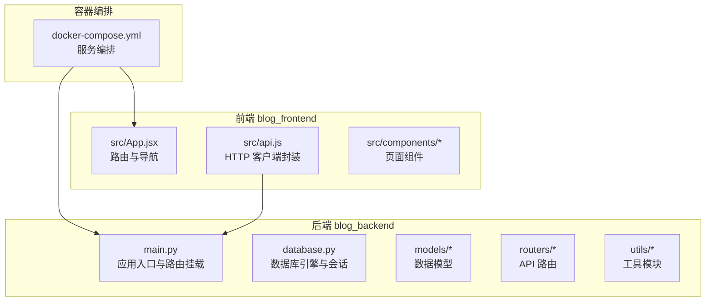
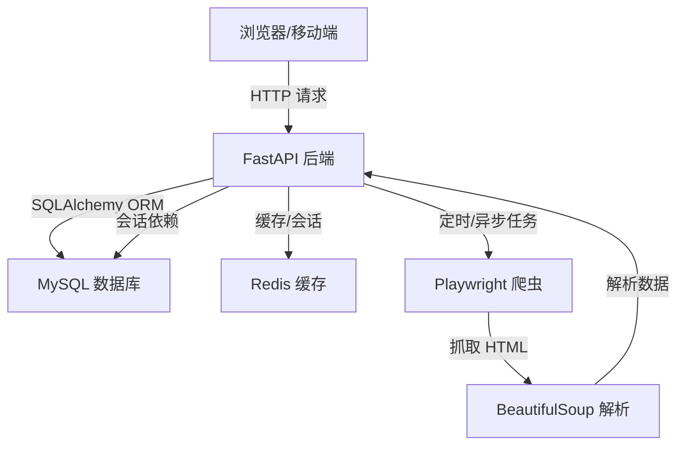
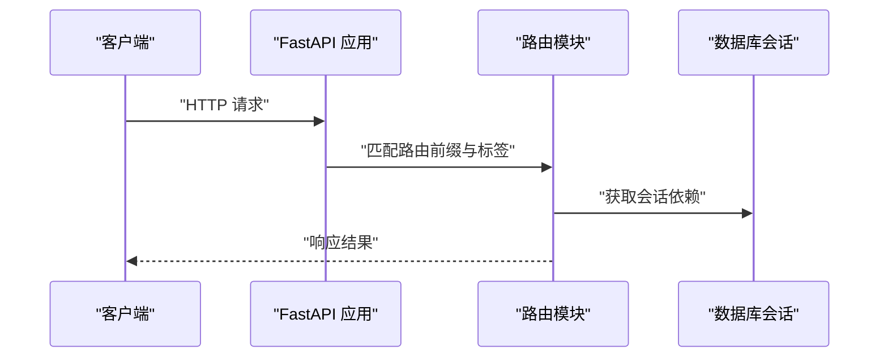
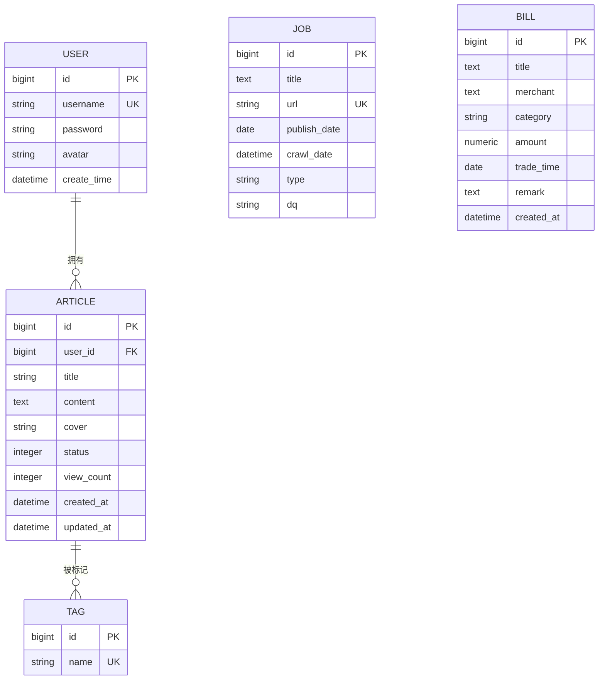
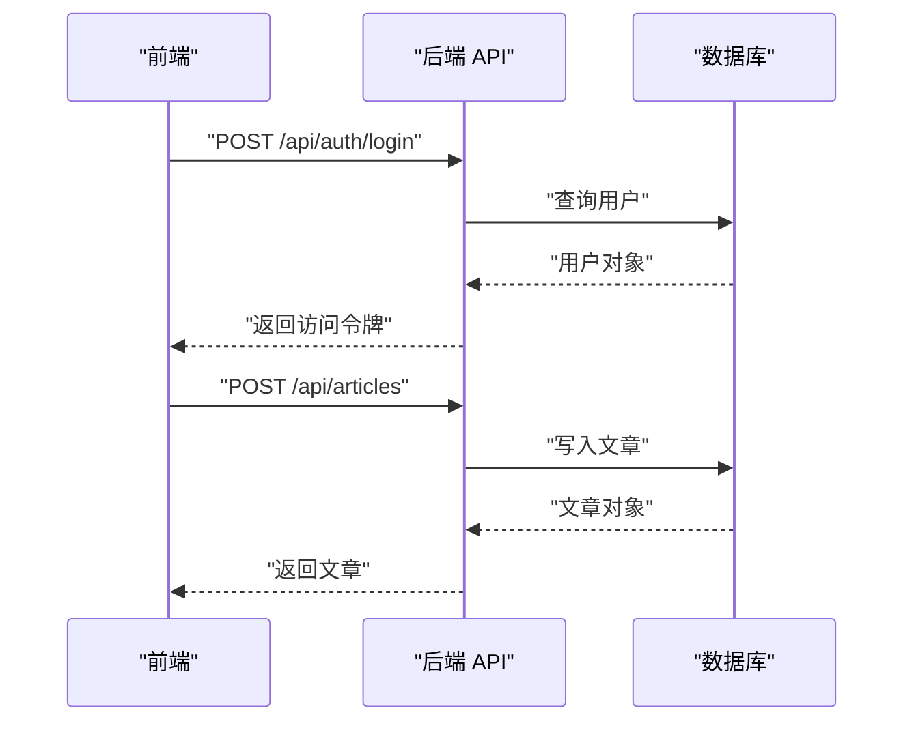
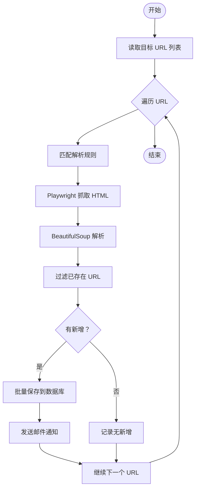
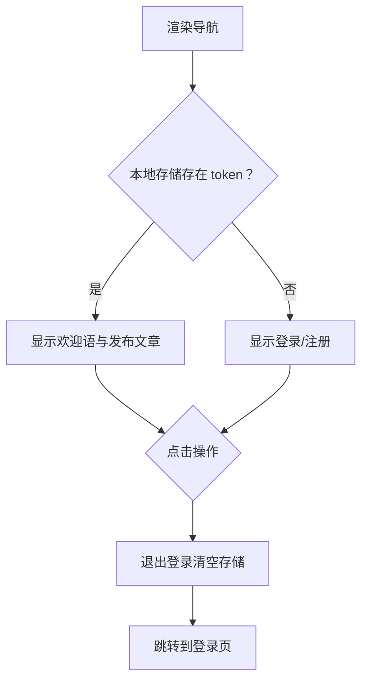
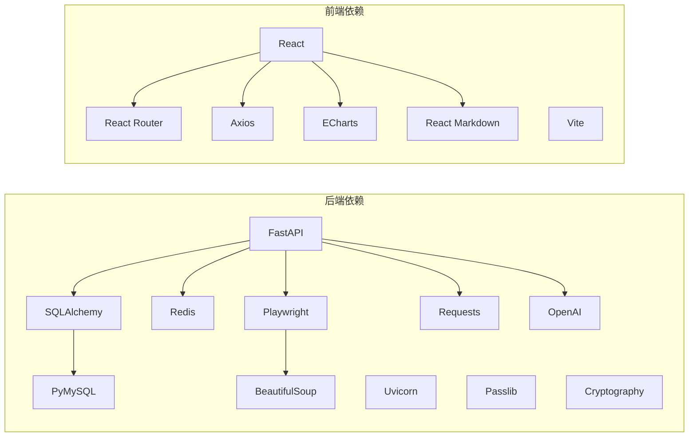

# 项目概述

<cite>
**本文引用的文件**
- [blog_backend/main.py](file://blog_backend/main.py)
- [blog_backend/pyproject.toml](file://blog_backend/pyproject.toml)
- [blog_backend/database.py](file://blog_backend/database.py)
- [blog_backend/models/user.py](file://blog_backend/models/user.py)
- [blog_backend/models/article.py](file://blog_backend/models/article.py)
- [blog_backend/models/job.py](file://blog_backend/models/job.py)
- [blog_backend/models/bill.py](file://blog_backend/models/bill.py)
- [blog_backend/routers/user.py](file://blog_backend/routers/user.py)
- [blog_backend/routers/article.py](file://blog_backend/routers/article.py)
- [blog_backend/utils/crawl.py](file://blog_backend/utils/crawl.py)
- [blog_frontend/src/App.jsx](file://blog_frontend/src/App.jsx)
- [blog_frontend/src/api.js](file://blog_frontend/src/api.js)
- [blog_frontend/package.json](file://blog_frontend/package.json)
- [docker-compose.yml](file://docker-compose.yml)
</cite>

## 目录
1. [引言](#引言)
2. [项目结构](#项目结构)
3. [核心组件](#核心组件)
4. [架构总览](#架构总览)
5. [详细组件分析](#详细组件分析)
6. [依赖分析](#依赖分析)
7. [性能考虑](#性能考虑)
8. [故障排除指南](#故障排除指南)
9. [结论](#结论)
10. [附录](#附录)

## 引言
本项目是一个前后端分离的全栈博客平台，目标是为用户提供完整的博客写作与阅读体验，同时集成招聘资讯爬取、智能记账与求职投递等实用功能。后端采用 Python 的 FastAPI 框架，前端采用 React 技术栈，通过 Docker 容器化部署，实现数据库、后端服务与前端静态资源的统一编排。

项目主要特性包括：
- 博客文章管理：支持发布、编辑、删除、分页查看与详情展示。
- 用户认证系统：提供注册、登录与基于令牌的访问控制。
- 招聘信息爬取：自动抓取指定站点的招聘信息并入库，支持邮件通知。
- 智能记账功能：支持账单录入、查询与分析。
- 求职投递系统：支持投递简历与记录状态。

技术栈概览：
- 后端：Python、FastAPI、SQLAlchemy、PyMySQL、Uvicorn、Redis、Playwright、BeautifulSoup、OpenAI、Passlib、Cryptography。
- 前端：JavaScript、React、React Router、Axios、ECharts、React Markdown。
- 数据库：MySQL。
- 容器化：Docker、docker-compose。

## 项目结构
项目采用前后端分离的目录组织方式，后端位于 blog_backend，前端位于 blog_frontend，根目录包含容器编排文件 docker-compose.yml。

图表来源
- [blog_backend/main.py:1-13](file://blog_backend/main.py#L1-L13)
- [blog_backend/database.py:1-18](file://blog_backend/database.py#L1-L18)
- [blog_frontend/src/App.jsx:1-79](file://blog_frontend/src/App.jsx#L1-L79)
- [blog_frontend/src/api.js:1-39](file://blog_frontend/src/api.js#L1-L39)
- [docker-compose.yml:1-41](file://docker-compose.yml#L1-L41)

章节来源
- [blog_backend/main.py:1-13](file://blog_backend/main.py#L1-L13)
- [blog_frontend/src/App.jsx:1-79](file://blog_frontend/src/App.jsx#L1-L79)
- [docker-compose.yml:1-41](file://docker-compose.yml#L1-L41)

## 核心组件
- 应用入口与路由挂载：在后端入口文件中集中注册用户、文章、招聘、记账、求职相关的路由前缀与标签，形成统一的 API 命名空间。
- 数据库层：通过 SQLAlchemy 建模用户、文章、标签、招聘、账单等实体，提供会话依赖注入以供各路由使用。
- 前端路由与导航：React Router 提供页面级路由，App 组件负责顶部导航与登录态维护。
- HTTP 客户端：前端通过 Axios 封装统一的 baseURL 与请求拦截器，自动携带认证令牌。
- 容器编排：docker-compose 将 MySQL、后端服务与前端 Nginx 配置为独立服务，按需暴露端口并设置依赖顺序。

章节来源
- [blog_backend/main.py:1-13](file://blog_backend/main.py#L1-L13)
- [blog_backend/database.py:1-18](file://blog_backend/database.py#L1-L18)
- [blog_frontend/src/App.jsx:1-79](file://blog_frontend/src/App.jsx#L1-L79)
- [blog_frontend/src/api.js:1-39](file://blog_frontend/src/api.js#L1-L39)
- [docker-compose.yml:1-41](file://docker-compose.yml#L1-L41)

## 架构总览
系统采用典型的三层架构：前端负责视图与交互，后端提供 REST API，数据库持久化数据。容器化将三者解耦，便于开发与部署。

图表来源
- [blog_backend/main.py:1-13](file://blog_backend/main.py#L1-L13)
- [blog_backend/database.py:1-18](file://blog_backend/database.py#L1-L18)
- [blog_backend/utils/crawl.py:1-425](file://blog_backend/utils/crawl.py#L1-L425)
- [blog_frontend/src/api.js:1-39](file://blog_frontend/src/api.js#L1-L39)

## 详细组件分析

### 后端应用入口与路由
- 入口文件集中注册用户、文章、招聘、记账、求职相关路由，统一前缀与标签，便于 API 文档与调用管理。
- 通过依赖注入获取数据库会话，保证每个请求的数据库连接生命周期可控。

图表来源
- [blog_backend/main.py:1-13](file://blog_backend/main.py#L1-L13)
- [blog_backend/routers/user.py:1-101](file://blog_backend/routers/user.py#L1-L101)
- [blog_backend/routers/article.py:1-85](file://blog_backend/routers/article.py#L1-L85)
- [blog_backend/database.py:1-18](file://blog_backend/database.py#L1-L18)

章节来源
- [blog_backend/main.py:1-13](file://blog_backend/main.py#L1-L13)
- [blog_backend/database.py:1-18](file://blog_backend/database.py#L1-L18)

### 数据模型与关系
- 用户模型：包含唯一用户名、密码、头像与创建时间。
- 文章与标签：多对多关联，支持文章与多个标签绑定；文章包含作者、标题、内容、封面、状态、浏览量与时间戳。
- 招聘信息：存储标题、URL、发布时间、抓取时间、类型与地区。
- 账单：存储商品/交易标题、商户、分类、金额、交易时间与备注。

图表来源
- [blog_backend/models/user.py:1-14](file://blog_backend/models/user.py#L1-L14)
- [blog_backend/models/article.py:1-41](file://blog_backend/models/article.py#L1-L41)
- [blog_backend/models/job.py:1-15](file://blog_backend/models/job.py#L1-L15)
- [blog_backend/models/bill.py:1-24](file://blog_backend/models/bill.py#L1-L24)

章节来源
- [blog_backend/models/user.py:1-14](file://blog_backend/models/user.py#L1-L14)
- [blog_backend/models/article.py:1-41](file://blog_backend/models/article.py#L1-L41)
- [blog_backend/models/job.py:1-15](file://blog_backend/models/job.py#L1-L15)
- [blog_backend/models/bill.py:1-24](file://blog_backend/models/bill.py#L1-L24)

### 用户认证与文章管理
- 用户认证：注册时检查用户名唯一性，登录时校验用户名与密码并返回访问令牌；前端通过请求拦截器自动附加 Authorization 头。
- 文章管理：支持发布、分页查询用户文章、详情查询、删除与编辑；删除与编辑均进行作者身份校验。

图表来源
- [blog_backend/routers/user.py:1-101](file://blog_backend/routers/user.py#L1-L101)
- [blog_backend/routers/article.py:1-85](file://blog_backend/routers/article.py#L1-L85)
- [blog_frontend/src/api.js:1-39](file://blog_frontend/src/api.js#L1-L39)

章节来源
- [blog_backend/routers/user.py:1-101](file://blog_backend/routers/user.py#L1-L101)
- [blog_backend/routers/article.py:1-85](file://blog_backend/routers/article.py#L1-L85)
- [blog_frontend/src/api.js:1-39](file://blog_frontend/src/api.js#L1-L39)

### 招聘信息爬取流程
- 规则驱动：根据 URL 关键词匹配解析规则，等待目标选择器加载后抓取 HTML。
- 解析与入库：解析不同站点的列表项，过滤重复 URL，批量保存至数据库并发送邮件通知。
- 调度与触发：可通过后端动作接口触发爬取或定时任务执行。

图表来源
- [blog_backend/utils/crawl.py:1-425](file://blog_backend/utils/crawl.py#L1-L425)
- [blog_backend/models/job.py:1-15](file://blog_backend/models/job.py#L1-L15)

章节来源
- [blog_backend/utils/crawl.py:1-425](file://blog_backend/utils/crawl.py#L1-L425)
- [blog_backend/models/job.py:1-15](file://blog_backend/models/job.py#L1-L15)

### 前端路由与导航
- 导航栏根据登录状态显示不同菜单：未登录显示登录/注册，已登录显示发布文章与退出登录。
- 路由覆盖首页、文章详情、文章编辑、用户搜索、招聘信息、智能记账与求职投递等页面。

图表来源
- [blog_frontend/src/App.jsx:1-79](file://blog_frontend/src/App.jsx#L1-L79)

章节来源
- [blog_frontend/src/App.jsx:1-79](file://blog_frontend/src/App.jsx#L1-L79)

## 依赖分析
- 后端依赖：FastAPI、SQLAlchemy、PyMySQL、Uvicorn、Passlib、Cryptography、Playwright、BeautifulSoup、OpenAI、Redis、Requests 等，覆盖 Web 框架、数据库、加密、爬虫与第三方服务。
- 前端依赖：React、React Router、Axios、ECharts、React Markdown、Vite 等，覆盖视图、路由、网络与可视化。
- 容器编排：MySQL、后端服务、前端服务，按依赖顺序启动，端口映射与环境变量配置清晰。

图表来源
- [blog_backend/pyproject.toml:1-22](file://blog_backend/pyproject.toml#L1-L22)
- [blog_frontend/package.json:1-28](file://blog_frontend/package.json#L1-L28)

章节来源
- [blog_backend/pyproject.toml:1-22](file://blog_backend/pyproject.toml#L1-L22)
- [blog_frontend/package.json:1-28](file://blog_frontend/package.json#L1-L28)

## 性能考虑
- 数据库连接：通过会话依赖注入管理连接生命周期，避免长连接泄漏；建议在生产环境启用连接池与超时策略。
- 爬虫并发：当前爬虫为同步实现，建议在后台任务中异步执行并限制并发，结合 Redis 去重与幂等处理。
- 前端缓存：利用浏览器缓存与组件级状态缓存减少重复请求；对长列表分页加载，避免一次性渲染过多节点。
- 静态资源：前端构建产物交由 Nginx 提供，建议开启 Gzip/Br 压缩与缓存头优化首屏加载。
- 容器资源：为 MySQL、后端与前端分别设置内存与 CPU 限制，避免资源争用。

## 故障排除指南
- 登录失败：检查用户名是否存在与密码是否一致；确认后端返回的访问令牌是否正确写入本地存储。
- 文章操作权限：删除与编辑需验证作者身份，若提示无权限，请确认当前登录用户与文章作者一致。
- 爬虫异常：检查目标站点结构变化导致的选择器失效；确认 Playwright 浏览器可正常启动与页面元素加载。
- 数据库连接：确认数据库服务可用、凭据正确与网络连通；检查 SQLALCHEMY_DATABASE_URL 配置。
- 前端请求失败：确认 baseURL 与代理配置正确；检查请求拦截器是否正确附加 Authorization 头。

章节来源
- [blog_backend/routers/user.py:1-101](file://blog_backend/routers/user.py#L1-L101)
- [blog_backend/routers/article.py:1-85](file://blog_backend/routers/article.py#L1-L85)
- [blog_backend/utils/crawl.py:1-425](file://blog_backend/utils/crawl.py#L1-L425)
- [blog_frontend/src/api.js:1-39](file://blog_frontend/src/api.js#L1-L39)

## 结论
本项目通过前后端分离与容器化实现了高内聚低耦合的架构设计，后端以 FastAPI 提供稳定 API，前端以 React 实现丰富的交互体验。数据库模型清晰，覆盖用户、文章、标签、招聘与账单等核心业务实体。爬虫模块具备可扩展的规则体系与邮件通知能力，适合作为招聘信息聚合与提醒工具。整体架构易于扩展，适合进一步引入缓存、消息队列与可观测性方案以提升稳定性与可维护性。

## 附录
- 快速启动：使用 docker-compose 启动 MySQL、后端与前端服务，按需调整端口与环境变量。
- 开发调试：后端使用 Uvicorn 运行，前端使用 Vite 开发服务器；数据库初始化脚本可按需执行。
- 扩展建议：引入 JWT 中间件、速率限制、审计日志与自动化测试，完善监控与告警体系。